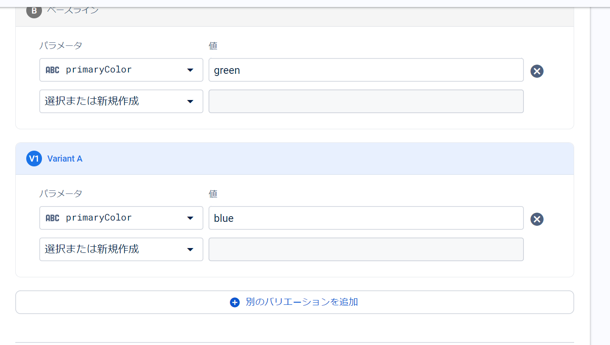
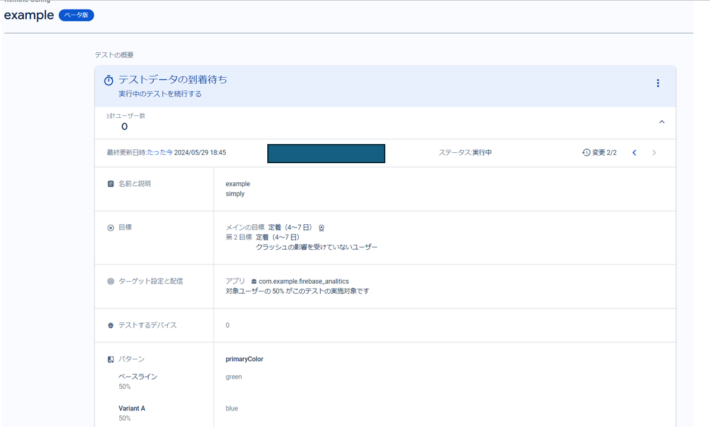

##  firebase remote config 

### メリット

- リアルタイムでのアプリ更新

- ユーザーセグメントごとに異なる設定を提供

A/Bテストと組み合わせることで、異なるバージョンの設定をテストし、最適な設定を見つけることができる


- 即時バグ修正

コードの再デプロイなどを行わずに 変更を反映できる


以下のようにkeyを指定するだけで remote の値を取得する
```sh
final remoteConfig = FirebaseRemoteConfig.instance;
  await remoteConfig.setConfigSettings(RemoteConfigSettings(
    fetchTimeout: const Duration(seconds: 10),
    minimumFetchInterval: const Duration(seconds: 10),
  ));
  await remoteConfig.fetchAndActivate();
  return remoteConfig.getString(key);
```


## firebase A/B test 
A/Bテストは、2つのバージョンのパフォーマンスを比較して、どちらがより効果的かを判断するための手法。Firebase A/Bテストを使用すると、アプリの変更がユーザー行動に与える影響を簡単にテストでき、データに基づいた意思決定を行うことができる。

https://youtu.be/OxMQORNh2E4







**ベースライン（Baseline）**は、実験の対照群として機能し、現行の状態や標準的なバージョンを表す。
**バリアントA（Variant A）**は、特定の変更や新しい機能を加えた実験群を指す。
統計学では、これらのグループ間の差を評価するためにt検定やχ²検定などの統計的手法が使用。


→ 簡単にいうと、 
。A/Bテストでは、例えば赤と青のボタンがどちらがクリックされやすいかを比較することができます。この場合、赤のボタンと青のボタンをそれぞれバリアントとして設定し、どちらがより多くクリックされるかを統計的に調べることができる。


### 検定のビジネスの活用例

1. ボタンの色を変更してクリック率を向上させる
シナリオ
あなたのアプリには重要なアクションをトリガーするボタンがあり、そのボタンのクリック率を向上させたいとします。仮説として、「赤いボタンは青いボタンよりもクリックされやすい」。

実装
Remote Configの設定:
Remote Configでボタンの色を設定します（例えば、button_colorキーにredとblueを設定）。


2. アプリ内の特定機能の使用率を向上させる

- シナリオ

あなたのアプリにはユーザーが利用するべき新機能があります。この機能の使用率を向上させるために、アプリのUIを変更するA/Bテストを行います。仮説として、 バナーがあるほうが 使用率の向上が見込める

- 実装
Remote Configの設定

Remote Configで新機能のプロモーションバナーの表示/非表示を設定（例えば、show_promo_bannerキーにtrueとfalseを設定）。


このように
t検定を用いて バナーの有意性を検定する。

