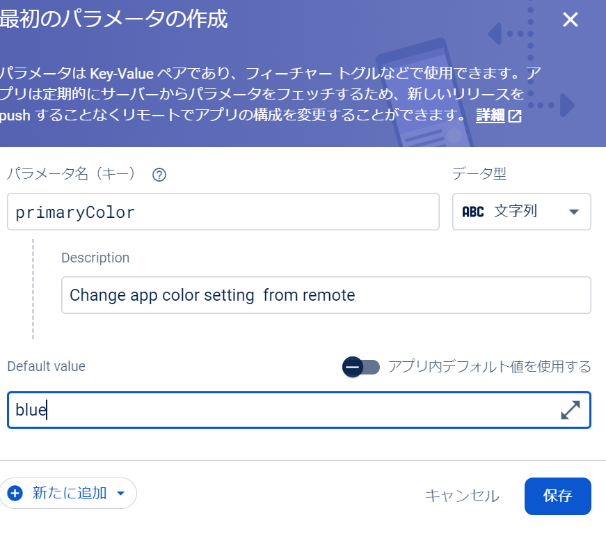

##  firebase remote config 

### メリット

- リアルタイムでのアプリ更新

- ユーザーセグメントごとに異なる設定を提供

A/Bテストと組み合わせることで、異なるバージョンの設定をテストし、最適な設定を見つけることができる


- 即時バグ修正

コードの再デプロイなどを行わずに 変更を反映できる




以下のようにkeyを指定するだけで remote の値を取得する
```sh
final remoteConfig = FirebaseRemoteConfig.instance;
  await remoteConfig.setConfigSettings(RemoteConfigSettings(
    fetchTimeout: const Duration(seconds: 10),
    minimumFetchInterval: const Duration(seconds: 10),
  ));
  await remoteConfig.fetchAndActivate();
  return remoteConfig.getString(key);
```


## firebase A/B test 
A/Bテストは、2つのバージョンのパフォーマンスを比較して、どちらがより効果的かを判断するための手法。Firebase A/Bテストを使用すると、アプリの変更がユーザー行動に与える影響を簡単にテストでき、データに基づいた意思決定を行うことができる。

https://youtu.be/OxMQORNh2E4


