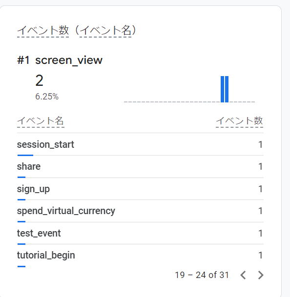
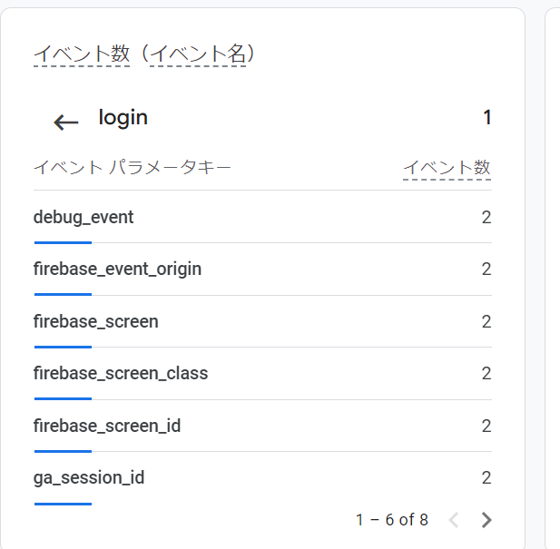

firebase analyticsの活用事例

- firebase でリアルタイムの分析を debugで行えるようにするコマンド
```sh
$  adb -s YOURDEVICEID shell setprop debug.firebase.analytics.app com.example.firebase_analitics
```


-  流れ
1. firebase analytics SKDをアプリにとりこみ必要な個所にイベントのmethodを仕込む

2. Firebase 搭載アプリを利用しデータがたまる

3. firebase コンソールでデータの可視化


- アプリの解析構成


- イベント名 を決める

ex)    screen_home :  ホーム画面を表示したときのログをとるなど


### 独自ユーザセグメントの作成
購入しているユーザとしてないユーザなど、Firebase analyticsではそういったユーザ層を「オーディエンス」という単位で独自に定義し、後ほど紹介するPush通知やA/Bテスト、広告配信などのセグメントとして指定できる。

- OSのバージョン

- デバイス

- 性別

などをフィルタリングにかけることが可能


それらの、オーディエンスはPush通知、A/Bテスト、 広告表示 などに活用できる。


ex) 最新のバージョンをつかっている。かつ広告のタップの回数が5回以上など
販売ができそうなユーザの見極めなどに使用できる


- データを活用した ターゲティング

上記で狙ったオーディエンスにリーチすることが可能

その、購入してほしい層に、お得なクーポンなどを Cloud messageingでけで完結できる


### 情報の種類

-  イベント


ex) ユーザーがloginした、スクリーンを表示したなど


- パラメータ


ex) イベントごとに 取得できる値


### 自動的に取得されるイベント

-  first_open      :   ユーザーがアプリをインストールまたは再インストールした後に、初めて起動したときに発生す
                    イベント

- in_app_purchase	 :   	iTunesのApp StoreまたはGoogle Playで処理されるアプリ内購入をユーザーが完了したとき                      に発生するイベント

- notification_open :   Firebase Cloud Messagingから送信された通知をユーザーが開いたときに発生するイベント

- screen_view     :   スクリーンが移動したときに発生するイベント（条件あり）

https://support.google.com/analytics/answer/9234069?hl=ja


### すべてのアプリで推奨されるイベント

- login     :  	ユーザーがログインしたとき
- purchase	:   ユーザーが購入手続きを完了したとき
- refund	  :   ユーザーが払い戻しを受け取ったとき
- search	  :   ユーザーがウェブサイトまたはアプリを検索したとき


### 小売とeコマースのイベント

- begin_checkout	 :  ユーザーが購入手続きを開始したとき
- purchase	       :  ユーザーが購入手続きを完了したとき
- refund	         :  ユーザーが払い戻しを受け取ったとき
- remove_from_cart :  ユーザーがショッピング カートから商品を削除したとき
- select_item	     :  ユーザーが商品やサービスのリストから商品を選択したとき

など。
全種類は以下
https://support.google.com/analytics/answer/9267735?hl=ja&visit_id=638525593973687217-4167530302&rd=2


上記のように、定石が存在する。


##  イベント名

####  analytics.logEvent

これは、nameでイベント名で指定できる




##   頻出のmethod 

###  analytics.logLogin(loginMethod: 'login');
この log~という関数は
firebase では以下のように表示される




