### firebase Cloud Messaging (FCM)

新しいメールやその他のデータがあることをクライアント アプリに通知できます。通知メッセージを送信することで、ユーザーにアプリを再度アピールし、
定着率の向上につなげることができる。

https://youtu.be/sioEY4tWmLI?list=PLl-K7zZEsYLmOF_07IayrTntevxtbUxDL


### Push通知

- Android :  Android Transport Layer(ATL)

- ios     :  Apple Push Notification Service(APNs)

上記それぞれを通して通知が送られてくる。


### FCM の仕組み


通知のテスト


### ios のセッティング

Appdelegate.swift に以下のコードを追加する

```swift
import UIKit
import Flutter
import Firebase
import FirebaseMessaging

@UIApplicationMain
@objc class AppDelegate: FlutterAppDelegate, MessagingDelegate {
  
  override func application(
    _ application: UIApplication,
    didFinishLaunchingWithOptions launchOptions: [UIApplication.LaunchOptionsKey: Any]?
  ) -> Bool {
    FirebaseApp.configure()
    
    Messaging.messaging().delegate = self
    
    GeneratedPluginRegistrant.register(with: self)
    if #available(iOS 10.0, *) {
      UNUserNotificationCenter.current().delegate = self
      let authOptions: UNAuthorizationOptions = [.alert, .badge, .sound]
      UNUserNotificationCenter.current().requestAuthorization(
        options: authOptions,
        completionHandler: {_, _ in })
    } else {
      let settings: UIUserNotificationSettings =
      UIUserNotificationSettings(types: [.alert, .badge, .sound], categories: nil)
      application.registerUserNotificationSettings(settings)
    }
    
    application.registerForRemoteNotifications()
    
    return super.application(application, didFinishLaunchingWithOptions: launchOptions)
  }

}
```


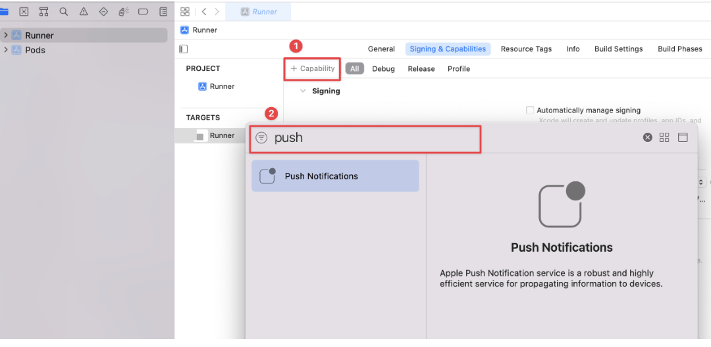

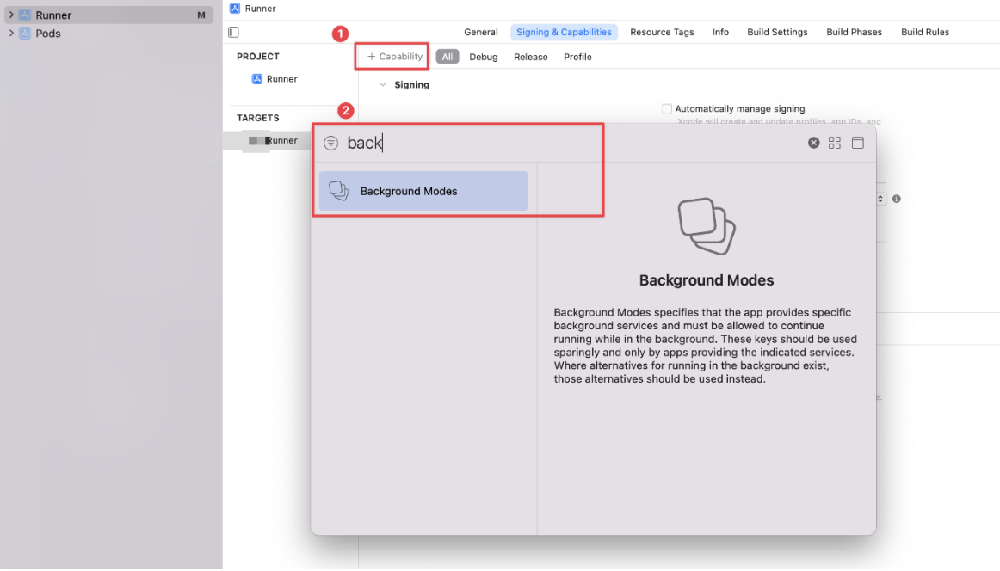


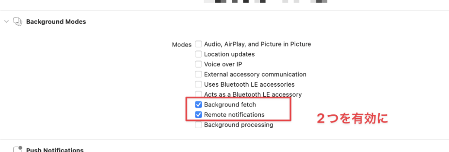


[AppleDeveloper](https://developer.apple.com/jp/)
を開き、Certificates, Identifiers & Profiles にアクセスして以下の手順で証明書を作成する。

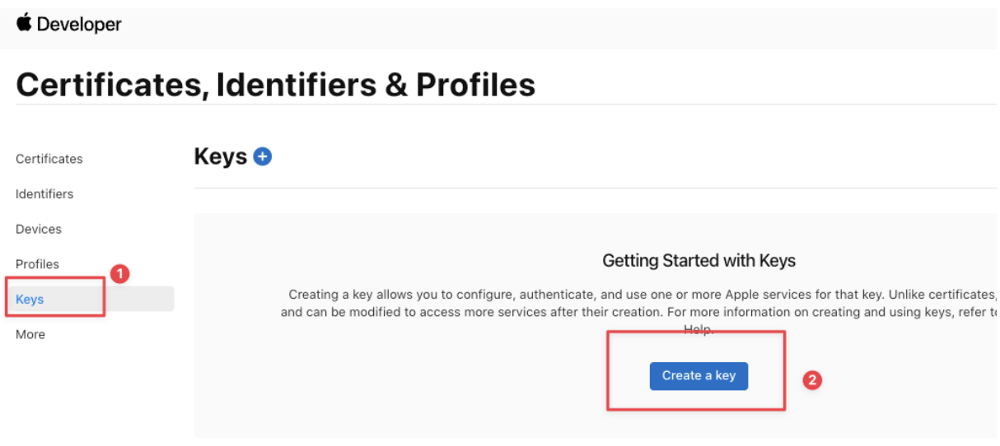


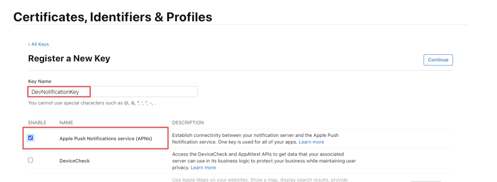


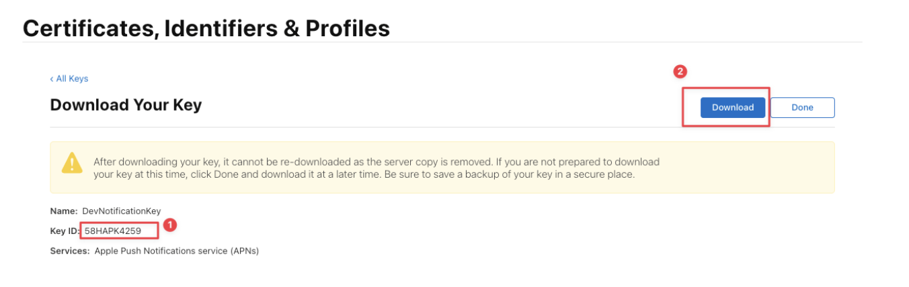


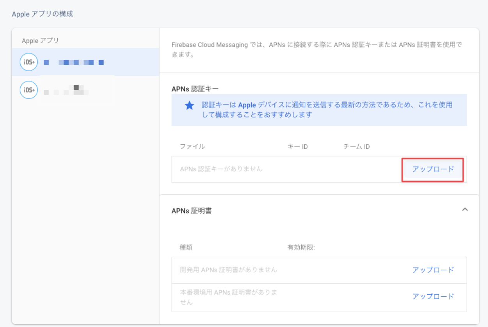


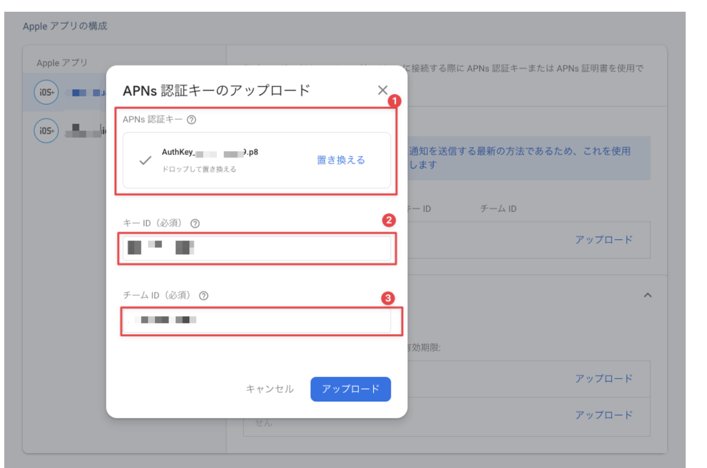


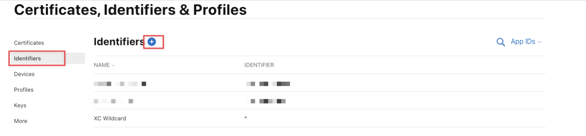


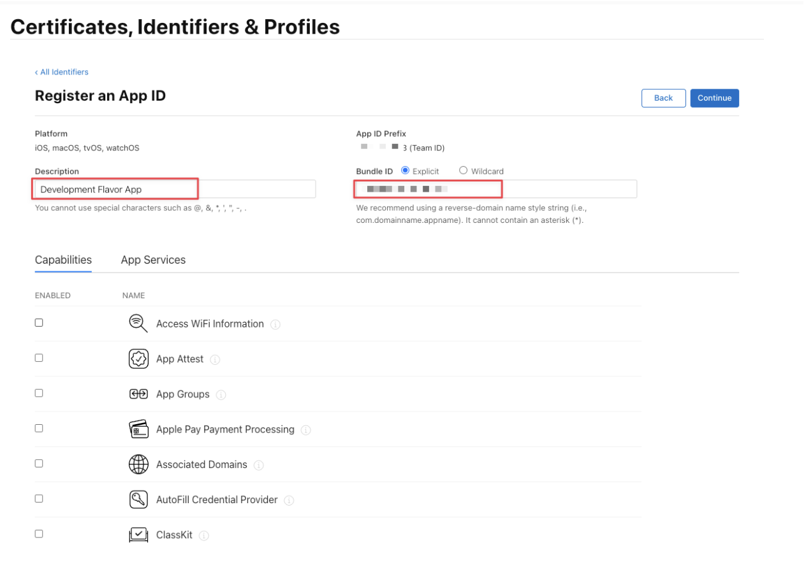


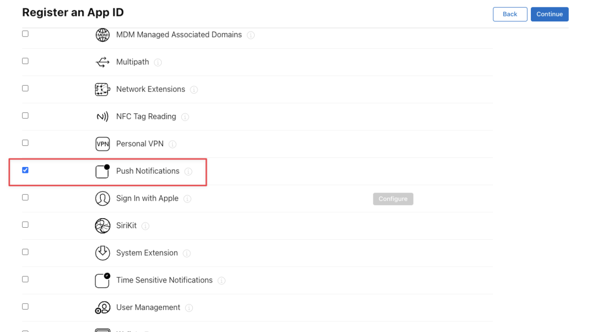


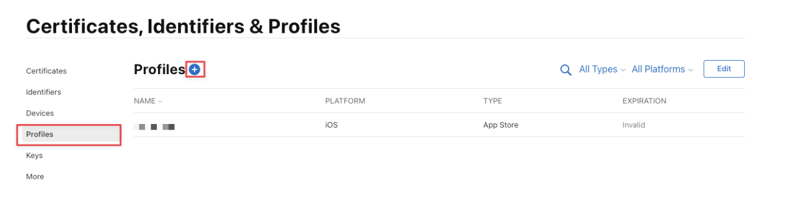


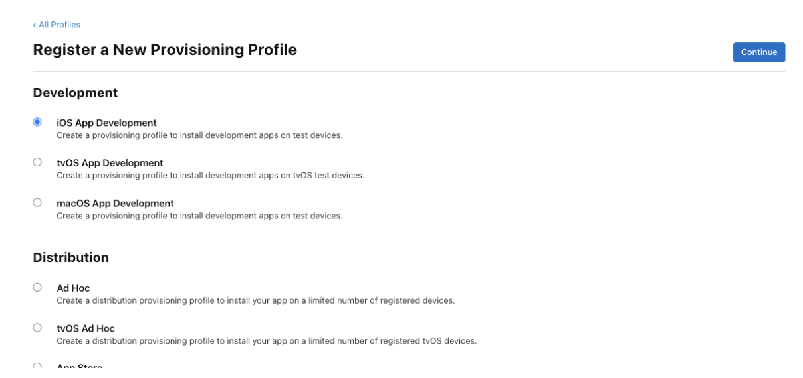


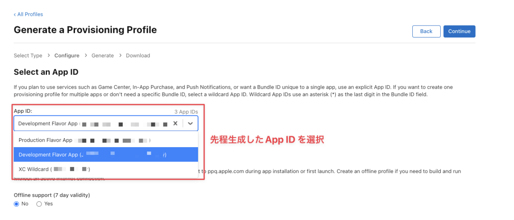


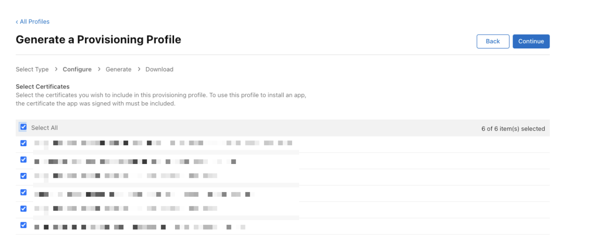


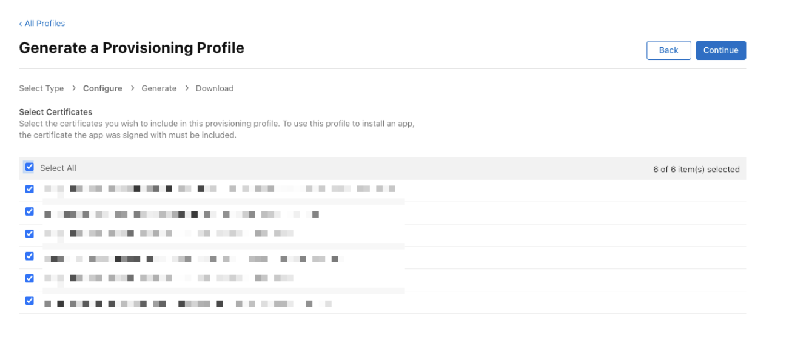


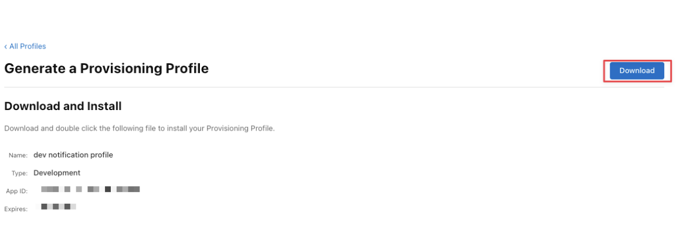


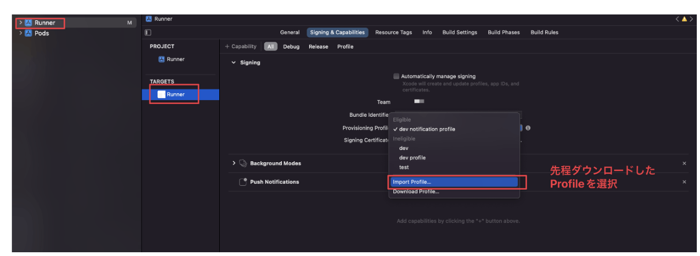
