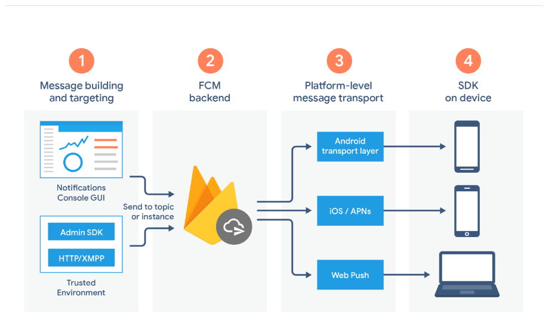
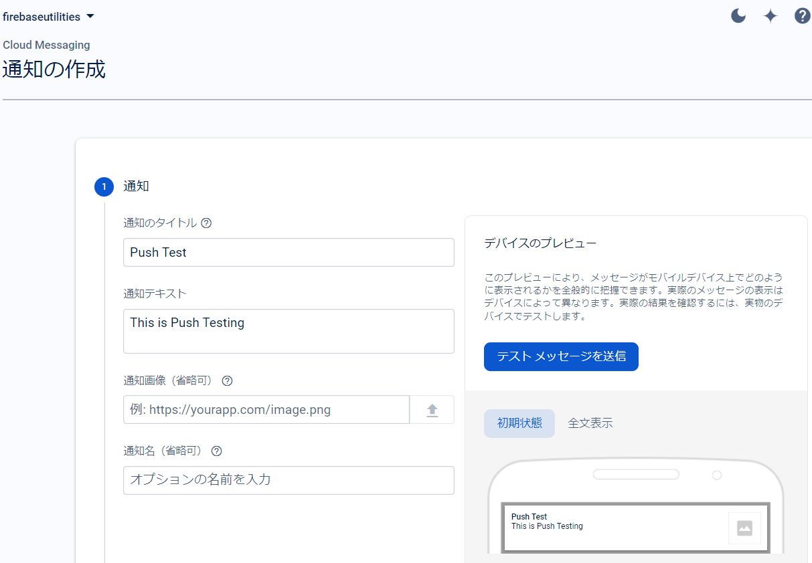
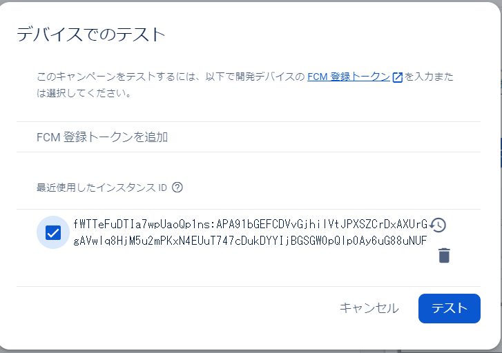
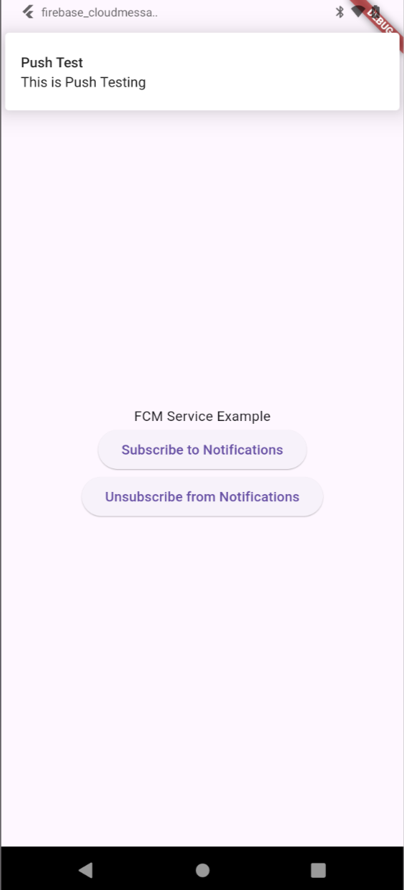
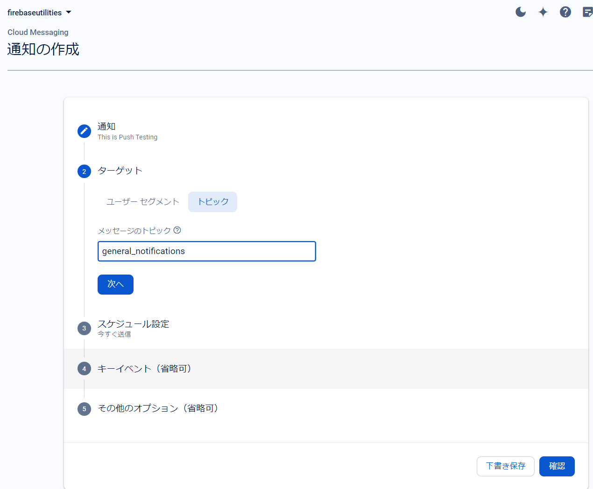

### firebase Cloud Messaging (FCM)

新しいメールやその他のデータがあることをクライアント アプリに通知できます。通知メッセージを送信することで、ユーザーにアプリを再度アピールし、
定着率の向上につなげることができる。

https://youtu.be/sioEY4tWmLI?list=PLl-K7zZEsYLmOF_07IayrTntevxtbUxDL

### Push通知

- Android :  Android Transport Layer(ATL)

- ios     :  Apple Push Notification Service(APNs)

上記それぞれを通して通知が送られてくる。

### FCM の仕組み

通知のテスト

